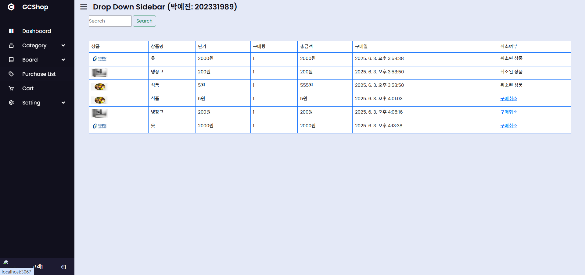

# webproj - 기본 게시판
**Node.js, HTML, CSS, JavaScript**

---

## 소개
상품을 구매할 수 있는 쇼핑몰입니다.

---

## 주요 기능
- 회원가입 / 로그인
- 상품 등록 / 판매
- 장바구니 / 상품 구입
- 게시판 및 페이징

---

## 파일 구조

---

## 사용자 화면

### 0. 회원가입 / 로그인 화면

- 개인정보 / 비밀번호 입력
- 입력 버튼 클릭 시 신규 회원가입 처리
### 1. 홈 화면 / 우측 메뉴

- 최신 상품 목록
- 검색 기능 및 카테고리

- 로그인 하지 않은 사용자는 상품 목록과 상품 상세 화면을 볼 수 있지만, 구매나 장바구니와 같은 기능을 이용할 수 없음
- 로그인 하지 않은 사용자가 로그인이 필요한 메뉴에 접근하면, 로그인 알림이 표시되며 로그인 화면으로 리디렉션

### 2. 상품 상세 화면

- 상품 이미지, 상품명, 가격, 브랜드, 공급업체
- 구매 / 장바구니 버튼

### 3. 장바구니 / 구매 상품 목록 화면
  
- 장바구니 담기한 목록
- 수량 변경
- 특정 상품 결제 / 삭제 버튼

- 구매 목록 화면
- 취소 가능, 취소 시 취소된 상품 표시

### 4. 상품 카테고리 / 검색 기능
  
- 상품 대분류코드:소분류코드로 하위 메뉴가 표시
- 하위 메뉴를 클릭하면 해당 카테고리에 속하는 상품이 표시

- 사용자가 검색창에 입력한 단어가 상품명, 제공업체명, 또는 브랜드에 포함된 경우 화면에 표시

### 5. 게시판 / 페이징

- 사용자가 글을 작성할 때는 제목, 내용, 갱신/삭제 시 비밀번호가 필수로 요구됨
- 사용자는 자신이 작성한 글에 대해서만 갱신/삭제를 할 수 있음
  

- 사용자가 자신이 작성한 글을 상세보기하면 갱신/삭제를 위한 수정 버튼과 삭제 버튼이 포함된 화면이 표시
- 갱신/삭제 시 비밀번호를 확인 후 일치 시에만 적용됨

- 다른 사람이 작성한 게시글은 다음과 같은 화면이 표시
---

## 관리자 화면 

### 0. 홈화면 / 메뉴

### . 게시판 / 페이징

