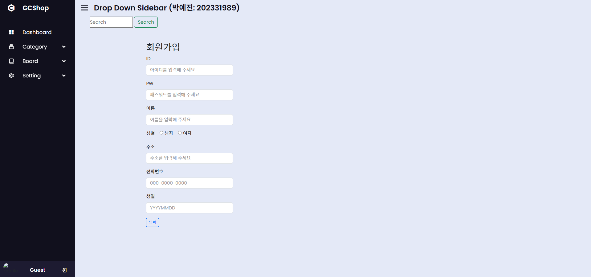

# webproj - 기본 게시판
**Node.js, HTML, CSS, JavaScript**

---

## 소개
상품을 구매할 수 있는 쇼핑몰입니다.

---

## 주요 기능
- 회원가입 / 로그인
- 상품 등록 / 판매
- 장바구니 / 상품 구입
- 게시판 및 페이징

---

## 파일 구조

---

## 사용자 화면

### 1. 홈 화면 / 우측 메뉴

- 최신 상품 목록
- 검색 기능 및 카테고리

### 2. 상품 상세 화면

- 상품 이미지, 상품명, 가격, 브랜드, 공급업체
- 구매 / 장바구니 버튼

### 3. 장바구니 / 구매 상품 목록 화면

- 장바구니 담기한 목록
- 수량 변경
- 특정 상품 결제 / 삭제 버튼
- 구매 목록 화면
- 취소 가능, 취소 시 취소된 상품 표시

### 4. 회원가입 / 로그인 화면

- 개인정보 / 비밀번호 입력
- 입력 버튼 클릭 시 신규 회원가입 처리

### 5. 게시판 / 페이징

---

## 관리자 화면 

### 1. 홈화면 / 메뉴

### 2. 게시판 / 페이징

